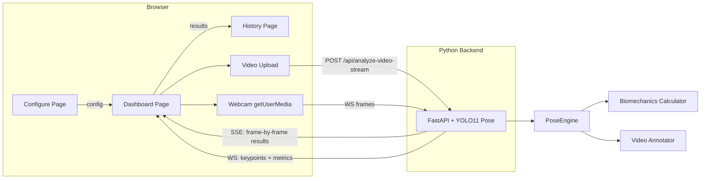

# WheelSense — YOLO11 Pose Estimation Integration Plan

Full integration of the existing YOLO11 Pose model (`model/best/`) with the WheelTrack-Analytics frontend to enable **video upload analysis** and **real-time webcam analysis** for wheelchair basketball players, with meaningful biomechanics metrics and injury prevention feedback.

---

## Current State Analysis

### What Exists

| Layer | Status | Notes |
|-------|--------|-------|
| **YOLO11 Pose model** | ✅ Ready | Saved at `model/best/` as a PyTorch checkpoint (~50 MB). 17-keypoint COCO skeleton. |
| **React Frontend** | ⚠️ Partially built | Home, Configure, Dashboard, History pages. Uses React + Vite + TailwindCSS + Three.js. Beautiful dark UI with orange accent. |
| **Express API Server** | ⚠️ Stub only | Only a `/healthz` endpoint exists. No pose estimation logic. |
| **Python scripts** | ⚠️ Detectron2-based | `extract_keypoints.py`, `train.py`, `evaluate.py` all use Detectron2 — **not** YOLO. These are stale. |
| **Configure page** | ❌ Wrong flow | Asks user to **upload a model file** (.onnx/.pkl/.h5). This must be removed — model should be preloaded. |
| **Dashboard page** | ❌ Mock data only | Uses `useMockData()` with random values. Court heatmap renders simulated trails. No real pose data flows in. |
| **History page** | ❌ Hardcoded | Shows hardcoded mock chart data and event logs. Not connected to any real analysis. |

### Key Problems to Fix

1. **Model upload UX must be removed** — The YOLO11 Pose model must be preloaded on the backend; users should only choose between uploading a video or opening a webcam.
2. **No Python backend exists** — The Express server cannot run PyTorch. We need a **Python FastAPI backend** that loads the YOLO model and serves pose estimation results.
3. **Dashboard shows only mock data** — Must be wired to receive real keypoint data from the backend and display live pose overlays + real metrics.
4. **Metrics are shallow** — Current gauges only show elbow/shoulder/trunk angles. We need comprehensive, meaningful biomechanics metrics for wheelchair basketball.
5. **Court heatmap section on Dashboard** — Must remain functional, but driven by real data instead of random jitter.

---

## User Review Required

> [!IMPORTANT]
> **Architecture Decision: Python Backend**
> Since the YOLO11 Pose model requires PyTorch, we need a **Python FastAPI server** running alongside the Vite frontend. The React frontend will communicate with it via REST (video upload) and WebSocket (real-time camera). The existing Express API server will remain as-is for any non-ML endpoints.

> [!WARNING]
> **Model Format**
> The model at `model/best/` appears to be a PyTorch checkpoint saved via `torch.save()` (standard YOLO format with `data.pkl` + numbered weight tensors). We will load it using `ultralytics.YOLO('model/best/')`. If this path doesn't work as-is, we may need to look for a `.pt` file or convert the checkpoint. Please confirm if there's a `.pt` file elsewhere.

> [!IMPORTANT]
> **Webcam Real-Time**
> For real-time camera analysis, the **webcam runs in the user's browser** (via `getUserMedia`). Frames are sent to the Python backend via WebSocket, processed with YOLO11 Pose, and keypoints are returned to the frontend for overlay rendering. This gives ~10-15 FPS on CPU, ~25-30 FPS on GPU.

---

## Open Questions

> [!IMPORTANT]
> 1. **Is there a `.pt` file for the YOLO model?** The `model/best/` folder contains raw PyTorch tensors. Typically YOLO exports a `best.pt` file. If not, we'll need to reconstruct it or check if the `model/best` directory itself is loadable by `ultralytics.YOLO()`.
> 2. **GPU or CPU?** Should the backend default to GPU (CUDA) if available, or CPU-only? This affects real-time FPS expectations.
> 3. **Do you want the History page to persist sessions across app restarts (database/file storage), or is in-memory storage acceptable for now?**

---

## Proposed Changes

### Component 1: Python FastAPI Backend (NEW)

This is the core inference engine. It preloads the YOLO11 Pose model on startup, processes video uploads frame-by-frame, and supports real-time WebSocket streaming for webcam analysis.

#### [NEW] [backend/main.py](file:///c:/ahmed%20pro/Wheel_Sense/backend/main.py)
FastAPI application entry point:
- **On startup**: Loads YOLO11 Pose model from `model/best/` into memory (preloaded — no user upload needed)
- **`POST /api/analyze-video`**: Accepts video file upload (mp4/avi/mov), runs YOLO pose estimation on every frame (or configurable `frame_skip`), returns complete JSON with per-frame keypoints + computed biomechanics metrics
- **`POST /api/analyze-video-stream`**: Same as above but uses Server-Sent Events (SSE) to stream results frame-by-frame so the frontend can show a progress bar and incremental results
- **`WebSocket /ws/analyze`**: Accepts base64 video frames from browser webcam, runs inference, returns keypoints + metrics per frame for real-time overlay
- **`GET /api/health`**: Health check + model status (loaded, device, keypoint count)
- CORS enabled for frontend origin

#### [NEW] [backend/pose_engine.py](file:///c:/ahmed%20pro/Wheel_Sense/backend/pose_engine.py)
Core inference wrapper:
- `PoseEngine` class that loads the YOLO11 Pose model once
- `predict_frame(frame: np.ndarray) -> list[PersonKeypoints]` — runs inference on a single frame
- `predict_video(video_path: str, frame_skip: int) -> AnalysisResult` — processes entire video
- Returns structured keypoint data (17 COCO keypoints with x, y, confidence per keypoint)
- Draws keypoints + skeleton connections on frames and returns annotated frames as base64 images

#### [NEW] [backend/biomechanics.py](file:///c:/ahmed%20pro/Wheel_Sense/backend/biomechanics.py)
Biomechanics computation engine — computes **meaningful metrics** from raw keypoints:

**Per-Frame Metrics:**
| Metric | How It's Computed | Why It Matters |
|--------|-------------------|----------------|
| **Elbow Flexion Angle** (left/right) | Angle at elbow between shoulder→elbow and elbow→wrist vectors | Key indicator of push phase efficiency. Optimal: 80-110° |
| **Shoulder Abduction Angle** (left/right) | Angle between torso vertical and shoulder→elbow vector | Recovery phase efficiency. Excessive abduction → injury risk |
| **Trunk Lean Angle** | Angle between vertical and the line from hip midpoint to shoulder midpoint | Forward lean affects power but excessive lean → back injury risk |
| **Wrist Velocity** | Δ(wrist position) / Δtime between frames | Push stroke power indicator |
| **Shoulder Elevation** | Vertical distance between shoulder and ear keypoints | Elevated shoulders indicate tension/fatigue |

**Aggregate Session Metrics:**
| Metric | How It's Computed | Why It Matters |
|--------|-------------------|----------------|
| **Push Stroke Count** | Detect cyclic wrist motion patterns (local minima in wrist-Y) | Propulsion frequency correlates with performance |
| **Push Stroke Symmetry Index** | `(Left_metric - Right_metric) / avg * 100` | Asymmetry > 15% indicates injury risk or compensation |
| **Average Push Phase Duration** | Time from push start to push end per stroke | Shorter push phases → better efficiency |
| **Recovery-to-Push Ratio** | Recovery time / Push time per stroke | Optimal ~1.2-1.5; too low = fatigue; too high = wasted time |
| **Trunk Stability Score** | Standard deviation of trunk lean angle over session | Lower = better core stability |
| **Fatigue Index** | Compare first 30% vs last 30% of session: Δ(stroke rate, joint angles, velocity) | Detects performance degradation over time |
| **Injury Risk Score** | Weighted composite: trunk lean (30%) + shoulder abduction (25%) + elbow hyperextension (20%) + asymmetry (15%) + fatigue (10%) | Overall risk assessment 0-100 |
| **Efficiency Classification** | Per-frame: efficient / inefficient / danger based on configurable thresholds | Real-time feedback |
| **Peak Joint Angles** | Max values reached during session for each joint | Identifies extreme positions |
| **Range of Motion (ROM)** | Max - Min angle per joint over session | Flexibility and consistency indicator |

#### [NEW] [backend/video_annotator.py](file:///c:/ahmed%20pro/Wheel_Sense/backend/video_annotator.py)
Renders pose estimation overlays onto video frames:
- Draws skeleton connections (colored lines between keypoints)
- Draws keypoint dots with confidence-based opacity
- Adds angle arc visualizations on elbows and shoulders
- Color-codes skeleton based on classification (green=efficient, yellow=warning, red=danger)
- Returns annotated frames as base64 for frontend display or compiles them into an annotated video file

#### [NEW] [backend/requirements.txt](file:///c:/ahmed%20pro/Wheel_Sense/backend/requirements.txt)
```
fastapi>=0.110.0
uvicorn[standard]>=0.27.0
ultralytics>=8.1.0
opencv-python>=4.9.0
numpy>=1.24.0
python-multipart>=0.0.9
websockets>=12.0
```

#### [NEW] [backend/start.py](file:///c:/ahmed%20pro/Wheel_Sense/backend/start.py)
Simple launcher script:
```python
import uvicorn
uvicorn.run("main:app", host="0.0.0.0", port=8000, reload=True)
```

---

### Component 2: Frontend — Configure Page Overhaul

The Configure page must be completely reworked: remove model upload, replace with **video upload** and **camera** options as the two primary input methods. The model is preloaded on the backend — user just picks their input source.

#### [MODIFY] [Configure.tsx](file:///c:/ahmed%20pro/Wheel_Sense/WheelTrack-Analytics/artifacts/wheeltrack/src/pages/Configure.tsx)

**Remove:**
- The `useDropzone` model upload zone (lines 71-135)
- The "Active Model" info card (lines 137-149)
- All model-related state (`model`, `onDrop`)

**Replace with:**

1. **Header**: "CONFIGURE SESSION" (keep existing)
2. **Left Column — Input Source:**
   - **Option 1: Upload Video** — Large drop zone accepting `.mp4`, `.avi`, `.mov`, `.webm`. Shows file name, size, and a thumbnail preview after upload.
   - **Option 2: Open Camera** — Button that requests `getUserMedia` permission. Shows a small preview of the camera feed when activated. Status indicator (camera connected / not connected).
   - **Selected source indicator** — Clear visual of which mode is active
3. **Right Column — Threshold Configuration** (keep existing sliders — they're good)
4. **Start Button** — Navigates to `/dashboard` and passes the configuration (source type, video file, thresholds) via React context or URL state

**New state flow:**
```
Configure (pick source + thresholds) → Dashboard (live analysis) → History (results review)
```

#### [NEW] [AnalysisContext.tsx](file:///c:/ahmed%20pro/Wheel_Sense/WheelTrack-Analytics/artifacts/wheeltrack/src/contexts/AnalysisContext.tsx)
React context to pass analysis configuration between pages:
- `sourceType: 'video' | 'camera'`
- `videoFile: File | null`
- `thresholds: { elbow: {warn, danger}, shoulder: {warn, danger}, trunk: {warn, danger} }`
- `analysisResults: AnalysisResult | null` (populated after analysis completes)
- `sessionHistory: AnalysisResult[]` (stores all completed sessions)

---

### Component 3: Frontend — Dashboard Page Overhaul

The Dashboard must be the central analysis hub, showing real pose estimation results with video playback and comprehensive metrics.

#### [MODIFY] [Dashboard.tsx](file:///c:/ahmed%20pro/Wheel_Sense/WheelTrack-Analytics/artifacts/wheeltrack/src/pages/Dashboard.tsx)

**Remove:**
- `useMockData()` hook — replace with real data from backend

**New Layout (two modes):**

##### Video Upload Mode:
```
┌─────────────────────────────────────────────────────────────┐
│  [Stat Pills: FPS | Confidence | Duration | Push Strokes]  │
├──────────────────────────┬──────────────────────────────────┤
│                          │  Joint Angles (3 GaugeArcs)      │
│   Video Player with      │  Classification Badge            │
│   Pose Skeleton Overlay  │  ──────────────────────          │
│   (keypoints drawn on    │  Push Stroke Symmetry            │
│    the video frames)     │  Trunk Stability Score           │
│                          │  Fatigue Index                   │
│   ◄ ▶ scrubber ►         │  Injury Risk Score (0-100)       │
│                          │  ──────────────────────          │
├──────────────────────────┤  Session Summary Cards           │
│   Court Heatmap          │  (ROM, Peak Angles, etc.)        │
│   (position tracking)    │                                  │
└──────────────────────────┴──────────────────────────────────┘
```

- **Left panel (70%)**: Video player showing the annotated video (with keypoints and skeleton overlaid). Playback controls (play/pause/seek). Frame-by-frame scrubbing to inspect specific poses.
- **Right panel (30%)**: Real-time metrics that update as the video plays. Includes all gauge arcs, classification badge, and the new comprehensive metrics.

##### Camera (Real-Time) Mode:
```
┌─────────────────────────────────────────────────────────────┐
│  [Stat Pills: FPS | Confidence | Court Time | Strokes]     │
├──────────────────────────┬──────────────────────────────────┤
│                          │  Joint Angles (3 GaugeArcs)      │
│   Live Camera Feed       │  Classification Badge            │
│   with Real-Time Pose    │  ──────────────────────          │
│   Skeleton Overlay       │  Real-Time Wrist Velocity        │
│   (WebSocket stream)     │  Trunk Stability (live)          │
│                          │  Symmetry Index (live)           │
│   🔴 RECORDING           │  Injury Risk Score (live)        │
│                          │  ──────────────────────          │
├──────────────────────────┤  Mini Joint Angle Chart          │
│   Court Heatmap          │  (last 30 seconds rolling)       │
│   (live position trail)  │                                  │
└──────────────────────────┴──────────────────────────────────┘
```

- **Left panel**: Canvas rendering the webcam feed with pose skeleton overlay drawn in real-time using `<canvas>` 2D context
- **Right panel**: Live-updating metrics via WebSocket
- **Stop button**: Ends session and navigates to History with full results

#### [NEW] [PoseOverlay.tsx](file:///c:/ahmed%20pro/Wheel_Sense/WheelTrack-Analytics/artifacts/wheeltrack/src/components/PoseOverlay.tsx)
Canvas component that renders pose keypoints and skeleton on top of video/camera frames:
- Draws 17 COCO keypoints as colored dots (size based on confidence)
- Draws skeleton connections with color-coded lines (green/yellow/red based on joint angle classification)
- Draws angle arcs at elbows and shoulders
- Smooth interpolation between frames for fluid appearance
- Responsive — scales with container

#### [NEW] [MetricsPanel.tsx](file:///c:/ahmed%20pro/Wheel_Sense/WheelTrack-Analytics/artifacts/wheeltrack/src/components/MetricsPanel.tsx)
Comprehensive metrics sidebar:
- Gauge arcs for elbow, shoulder, trunk (existing components, reused)
- Classification badge (existing, reused)
- **NEW**: Push stroke symmetry bar (left vs right visual comparison)
- **NEW**: Trunk stability gauge (0-100 score)
- **NEW**: Fatigue index progress bar with trend arrow
- **NEW**: Injury risk score — large circular gauge with color zones
- **NEW**: Mini line chart showing joint angles over last 30s (rolling window)
- **NEW**: Session insights — text feedback cards like "Elbow hyperextension detected at 00:45 — consider reducing push force"

#### [NEW] [InjuryRiskGauge.tsx](file:///c:/ahmed%20pro/Wheel_Sense/WheelTrack-Analytics/artifacts/wheeltrack/src/components/InjuryRiskGauge.tsx)
Large semi-circular gauge showing overall injury risk (0-100):
- 0-30: Green "Low Risk"
- 30-60: Yellow "Moderate Risk"  
- 60-80: Orange "High Risk"
- 80-100: Red "Critical Risk"
- Animated needle with glow effects
- Breakdown tooltip showing individual contributing factors

#### [NEW] [VideoPlayer.tsx](file:///c:/ahmed%20pro/Wheel_Sense/WheelTrack-Analytics/artifacts/wheeltrack/src/components/VideoPlayer.tsx)
Custom video player for analyzed video playback:
- Shows the annotated video (with skeleton overlay rendered by backend)
- Frame-by-frame controls
- Timeline with markers at danger events
- Current frame's metrics displayed in sync with playback position

#### [NEW] [useAnalysis.ts](file:///c:/ahmed%20pro/Wheel_Sense/WheelTrack-Analytics/artifacts/wheeltrack/src/hooks/useAnalysis.ts)
Hook that manages the analysis lifecycle:
- **Video mode**: `POST` video to `/api/analyze-video-stream`, receive SSE stream of per-frame results, accumulate into full analysis
- **Camera mode**: Open WebSocket to `/ws/analyze`, send frames from `getUserMedia`, receive keypoints + metrics in real-time
- Computes aggregate metrics client-side as frames arrive
- Returns: `{ frames, currentMetrics, aggregateMetrics, isAnalyzing, progress, error }`

---

### Component 4: Frontend — History Page Enhancement

#### [MODIFY] [History.tsx](file:///c:/ahmed%20pro/Wheel_Sense/WheelTrack-Analytics/artifacts/wheeltrack/src/pages/History.tsx)

**Remove:**
- Hardcoded `chartData`, `events`, `summary`, `breakdown` arrays

**Replace with:**
- Data pulled from `AnalysisContext.sessionHistory`
- If no sessions exist, show an empty state with "No sessions yet — start your first analysis"
- Chart data generated from actual frame-by-frame joint angle data
- Events generated from actual danger/warning threshold crossings
- Summary cards computed from real aggregate metrics
- **NEW**: Recommendations section at the bottom — AI-generated text feedback based on the session results:
  - "Your trunk lean exceeded safe limits 12 times. Focus on core strengthening exercises."
  - "Left-right symmetry index: 8.2% — within healthy range."
  - "Fatigue detected after minute 3:20 — consider interval training to improve endurance."
  - "Push stroke efficiency improved 15% compared to last session."

---

### Component 5: Frontend — App & Navigation Updates

#### [MODIFY] [App.tsx](file:///c:/ahmed%20pro/Wheel_Sense/WheelTrack-Analytics/artifacts/wheeltrack/src/App.tsx)
- Wrap routes in `<AnalysisProvider>` context
- No changes to route structure

#### [MODIFY] [Navbar.tsx](file:///c:/ahmed%20pro/Wheel_Sense/WheelTrack-Analytics/artifacts/wheeltrack/src/components/Navbar.tsx)
- Update "Configure" link label to "Analyze" for clarity
- Add active state indicators

---

### Component 6: Startup Script Updates

#### [MODIFY] [run.bat](file:///c:/ahmed%20pro/Wheel_Sense/run.bat)
Update to also start the Python backend:
- Start Python FastAPI server (`python backend/start.py`) in a background process
- Wait for it to be ready (poll `/api/health`)
- Then start the Vite frontend as before

#### [NEW] [backend/install.bat](file:///c:/ahmed%20pro/Wheel_Sense/backend/install.bat)
One-time setup script:
```bat
pip install -r requirements.txt
```

---

## Detailed Metrics Explanation

### Why These Metrics Matter for Wheelchair Basketball

| Metric | Clinical/Sports Significance |
|--------|------------------------------|
| **Elbow Flexion** | Push phase biomechanics. Overextension (>130°) causes repetitive strain injury (RSI) in the elbow joint, common in wheelchair basketball players. |
| **Shoulder Abduction** | Recovery phase. Excessive abduction (>110°) leads to rotator cuff impingement — the #1 injury in wheelchair athletes. |
| **Trunk Lean** | Forward lean increases push power but excessive lean (>50°) compresses lumbar spine. Wheelchair basketball players have 3× higher back injury rates. |
| **Push Stroke Symmetry** | Asymmetric propulsion causes uneven wear on shoulders. >15% asymmetry strongly correlates with unilateral shoulder pain within 6 months. |
| **Fatigue Index** | Performance degrades as fatigue sets in — stroke rate drops, angles become more extreme, form breaks down. Early detection allows timely rest. |
| **Injury Risk Score** | Composite score synthesizing all risk factors into a single actionable number. Enables coaches to make data-driven substitution decisions. |
| **Range of Motion** | Tracking ROM over sessions detects progressive loss of flexibility — an early sign of injury or overtraining. |
| **Wrist Velocity** | Push power proxy. Declining velocity across a session indicates fatigue. Comparing left vs right indicates compensation patterns. |

---

## Data Flow Architecture



---

## File Summary

| Action | File | Description |
|--------|------|-------------|
| NEW | `backend/main.py` | FastAPI server with video upload + WebSocket endpoints |
| NEW | `backend/pose_engine.py` | YOLO11 Pose model wrapper |
| NEW | `backend/biomechanics.py` | Joint angle + aggregate metric computation |
| NEW | `backend/video_annotator.py` | Draws pose skeleton overlay on frames |
| NEW | `backend/requirements.txt` | Python dependencies |
| NEW | `backend/start.py` | Uvicorn launcher |
| NEW | `backend/install.bat` | Dependency installer |
| MODIFY | `Configure.tsx` | Remove model upload, add video upload + camera options |
| MODIFY | `Dashboard.tsx` | Replace mock data with real pose estimation results |
| MODIFY | `History.tsx` | Replace hardcoded data with real session results |
| MODIFY | `App.tsx` | Add AnalysisContext provider |
| MODIFY | `Navbar.tsx` | Update navigation labels |
| MODIFY | `run.bat` | Add Python backend startup |
| NEW | `AnalysisContext.tsx` | React context for cross-page state |
| NEW | `PoseOverlay.tsx` | Canvas-based pose skeleton renderer |
| NEW | `MetricsPanel.tsx` | Comprehensive metrics sidebar |
| NEW | `InjuryRiskGauge.tsx` | Injury risk circular gauge |
| NEW | `VideoPlayer.tsx` | Custom annotated video player |
| NEW | `useAnalysis.ts` | Analysis lifecycle hook |

---

## Verification Plan

### Automated Tests
1. **Backend health check**: `curl http://localhost:8000/api/health` — verify model loaded status
2. **Video upload test**: Upload a sample wheelchair basketball video via `curl -X POST -F "video=@sample.mp4" http://localhost:8000/api/analyze-video` — verify JSON response with keypoints
3. **WebSocket test**: Connect to `ws://localhost:8000/ws/analyze` and send a test frame — verify keypoint response
4. **Frontend build**: `pnpm run build` in the wheeltrack artifact — verify no TypeScript errors

### Manual Verification
1. **Video Upload Flow**: Navigate to Configure → Upload a video → Start Analysis → Verify pose skeleton overlay appears on video frames → Check all metrics update as video plays → Navigate to History and verify session data appears
2. **Camera Flow**: Navigate to Configure → Select Camera → Start Analysis → Verify live webcam feed with pose overlay → Check real-time metrics updating → Stop session → Verify History populated
3. **Dashboard Court Section**: Verify the court heatmap renders with position trail based on real keypoint data
4. **Metrics Accuracy**: Manually verify a few frames' joint angles match expected values (measure angles in a frame editor)
5. **Edge Cases**: Test with no person in frame, multiple people, poor lighting, side angles
